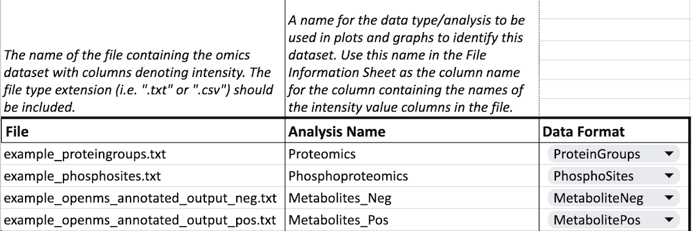
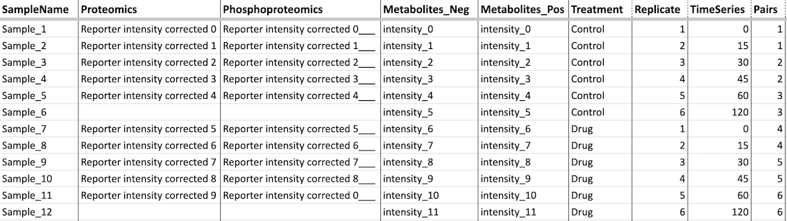

# Inputs

### Annotation File

To view a formatted example that you can use as a template click here: [Example_Annotation](https://docs.google.com/spreadsheets/d/1ab6SyMBcuTSNCfcW4bqwygdhH_Ruw3kOPcylBDqaijg/edit?usp=drive_link "Formatted Example Annotation Google Sheets Template")

For an empty template to use click here: [Empty_Annotation_Template](https://docs.google.com/spreadsheets/d/1YmDqFalNNnnbxI66P-yGa44cwnT9EoqyXad2v0ACPus/edit?usp=drive_link "Empty Annotation Google Sheets Template")

The annotation file provides a standard way to read in the experimental data. There are two sheets for inputting information about data sets. Instructions for use are also on the first sheet of the annotation file template.

#### Sheet: Inputs

-   Start by typing the names of the files this annotation file will be referencing under **File**.

-   For each file then add a name under **Analysis Name** . This name can be anything of your choosing, though it is recommended that it be descriptive of the type of analysis being performed.

-   Finally, selecte a **Data Format** from the dropdown menu that correlates with the file type.

#### Sheet: File Information

There are three required columns in the File Information sheet, though you may choose to include more:

1.  SampleName: This column should contain unique, descriptive names for each individual sample. It is recommended that there are no spaces in the name, characters such as "\_" or "-" may be used instead.
2.  Intensity Values: There should be a column containing intensity values for each file input (so one at minimum). This column MUST be have the same name as the Analysis Name input in the Inputs sheet so that Omics Notebook knows which intensity values correlate with which file inputs.
3.  Grouping Information: There must be at least one column that provides groupings for the samples for analysis. You may provide more than one column to give different possible groupings and then select which column to use for analysis in the Omics Notebook application. Examples of possible columns can be seen in the File Information sheet: "Treatment" & "Strain". The column chosen will determine contrasts for differential analysis.

### Data Files

Data files should be a tab delimited `.txt` file, with data column names, corresponding to samples, specified in the annotation file. Standardized annotation currently configured for analysis is as follows:

-   Columns with HGNC gene symbols should be called "Gene".
-   Columns with Uniprot IDs should be called "Protein".

> If no identifier columns are found in the dataset, the first column will automatically be used as the feature identifier.

The tool will parse MaxQuant output to create Gene and Protein columns from the existing columns in standard MaxQuant outputs. Example data, annotation file, and output are provided in [this Google Drive folder](https://drive.google.com/drive/folders/1lyzmIhorrZy_CKuxabi1Bv1cLHIblJhk?usp=drive_link).

#### Generic

The `Generic` data format can be used if your data is not output from one of the commonly used preprocessing pipelines, such as MaxQuant, or if you want to explore a pre-configured or pre-processed expression matrix. This format requires a column for each sample containing intensity values, similar to all other inputs. In addition to intensity columns, at minimum a `Protein` and/or `Gene` column should be included, with UniProt IDs or HGNC gene symbols as described in the above section.

#### RNA

RNA data requires a unique column which should be named `Ensembl` and which should contain Ensembl IDs for each row. If you do not also provide `Gene` and `Protein` columns, OmNI will use the Ensembl IDs to map to HGNC gene symbols and UniProt protein IDs using available databases. Please note that different databases have different available mappings and that some Ensembl IDs map to multiple UniProt IDs and visa versa.

#### Metabolomics Data

Currently the best way to pre-process metabolomics data is by using MetaboAnalyst. For more information on this tool and related pipeline on MetaboAnalyst's website [click here](https://www.metaboanalyst.ca/). Once data has been processed via MetaboAnalyst the output file `annotated_peaklist.csv` can be input as a data file input.
