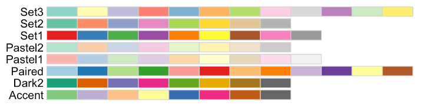
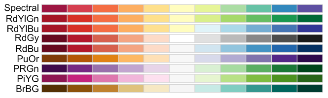

# Omics Notebook Interactive

## Getting Started

Start by uploading data in the `Data` tab under the `Data Upload` header. Multiple datasets are allowed, but all must be included in the annotation file uploaded. More information on accepted file types and formatting the annotation file can be found in the `File Inputs` section of the `About` tab.

> It may be helpful to start by generating a report that gives a summary of plots and analysis to get a big picture overview of the data set. To do this go to the `Generate Report` tab after completing the inputs in the `Data Upload` tab as described below. Choose which groups and contrasts you want to include and adjust the presets as desired. Then click *Download Report*. The Excel Data summary provides an overview of the calculations made for each row, click *Download Excel Summary* to view.

Once the data and annotation files are uploaded there are additional selections that define annotation information and metadata relevant to the generation of analysis plots and data processing:

1.  `Groups`: Omics Notebook will generate a drop-down menu with options of columns to use to group by. The chosen column should have a group assigned to every sample and have at least two groups with replicates for each group. You may also choose multiple columns to form groups. When multiple columns are chosen they will be combined to form a unique 'Groups' column. Groups will be used for analysis and will determine the contrasts created for differential analysis and enrichment.
2.  `Species`: The chosen species will be used for enrichment to provide relevant pathway database options.
3.  Data Processing/Cleaning Checkboxes:
    -   `Log-Transform`: Check to perform log-transform on the expression set produced from the input data.
    -   `Impute Missing Values`: Whether to impute zeros in the dataset (uses the `mice` package).
    -   `Remove Outliers`: Whether to remove outlier values from each sample column.
    -   `Uniprot Annotation`: Check to get Uniprot annotation on the expression set.
4. `Normalization`: Choose a method for data normalization from the drop down menu, it will be applied to the expression set object. Options are None, Quantile, Loess, Median, Median Absolute Deviation (MAD), Z-Transform, and Internal Reference Scaling (IRS).
5. `Zero Value Cutoff`: The allowed proportion of zeros in a row before it is removed.

Omics Notebook will print the data set/analysis name and format that was provided in the annotation file underneath the header "Dataset Name". Check that this aligns with the data set you uploaded.

After making these selections data exploration and analysis can begin! In the `Data` tab there are additional options for viewing your data pre and post normalization. Under `Basic Analysis` there is PCA, UMAP, correlation analysis, and MD & heatmap plotting. The `Single Omic Analysis` tab allows for the design and exploration of a linear model using the `limma` package along with volcano plots and differential heatmapping. The `Multi Omic Analysis` tab allows integration of multiple omic datasets via S-score, and the `Network Analysis` tab uses PCSF to create interactive networks from either S-score or `limma` outputs. The `Enrichment` tabs under the `Single Omic Analysis`, `Multi Omic Integration`, and `Network Analysis` tabs allows for exploration of gene set and pathway analysis of enriched genes and proteins, both ranked and unranked.

------------------------------------------------------------------------

### Palettes

For graphs that use palette inputs, ColorBrewer is used. Graphs that use qualitative palettes, such as PCA and UMAP, will have the palette options seen below. The number of groups will determine how many of the colors are used. Colors are added from left to right, i.e. a dataset with two groups will use only the first two colors on the left. If there are more groups than there are color options, the palette will default to a generic rainbow palette.

Graphs that use diverging palettes, like the heatmap, will have the following palette options:

